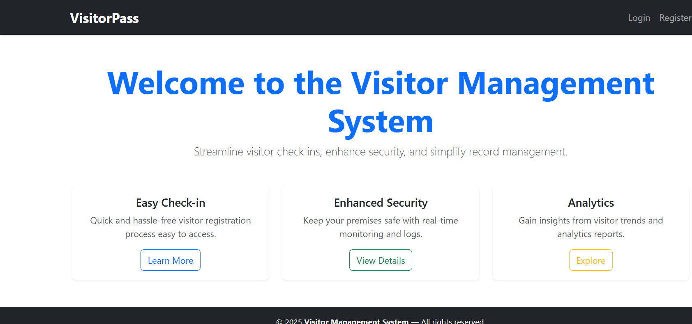
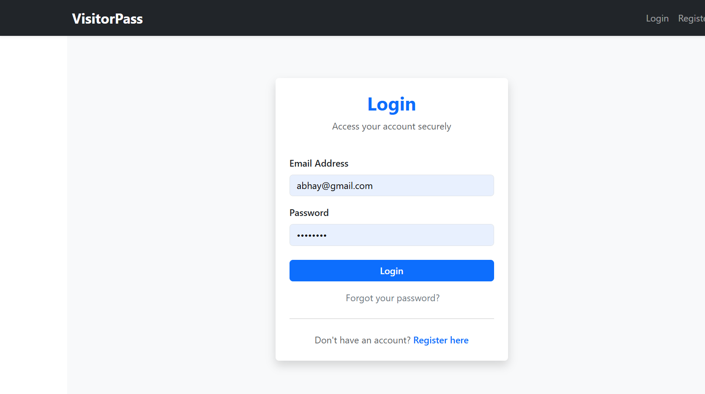
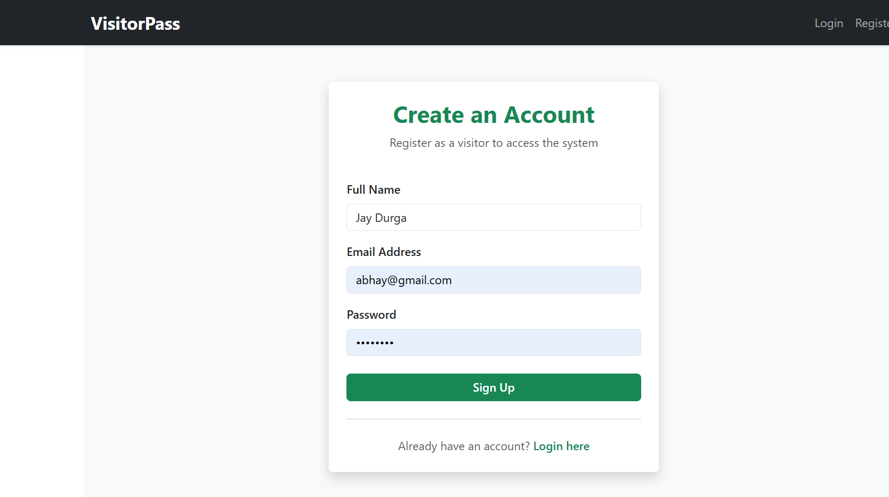
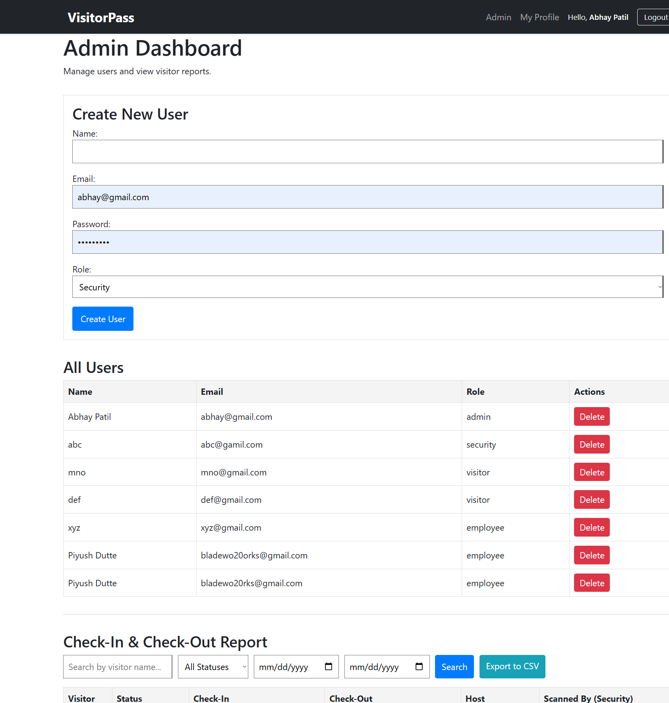
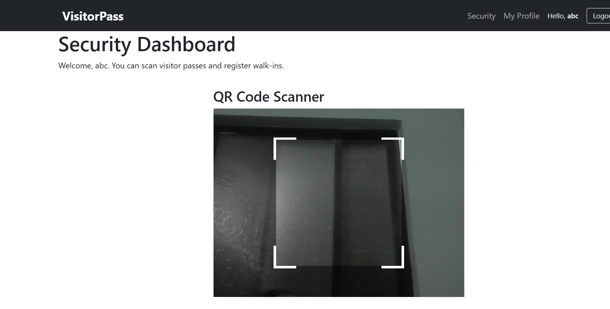
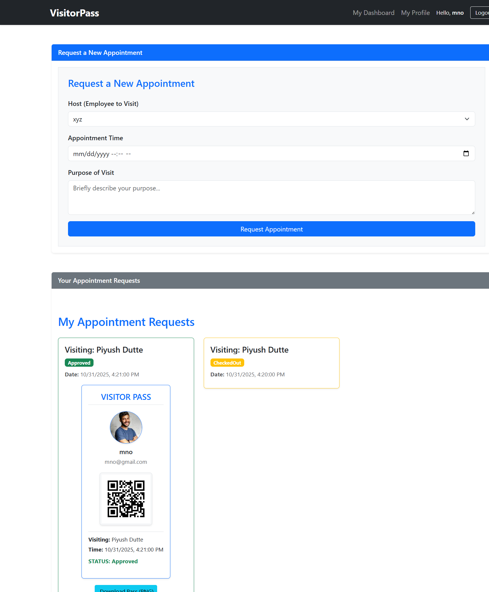
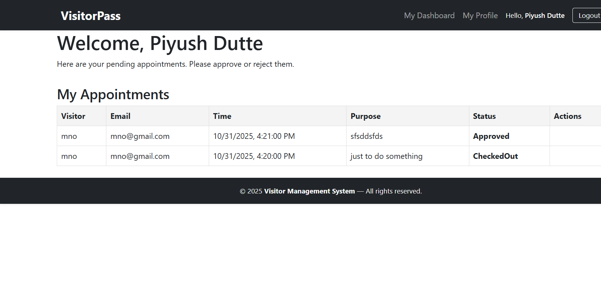
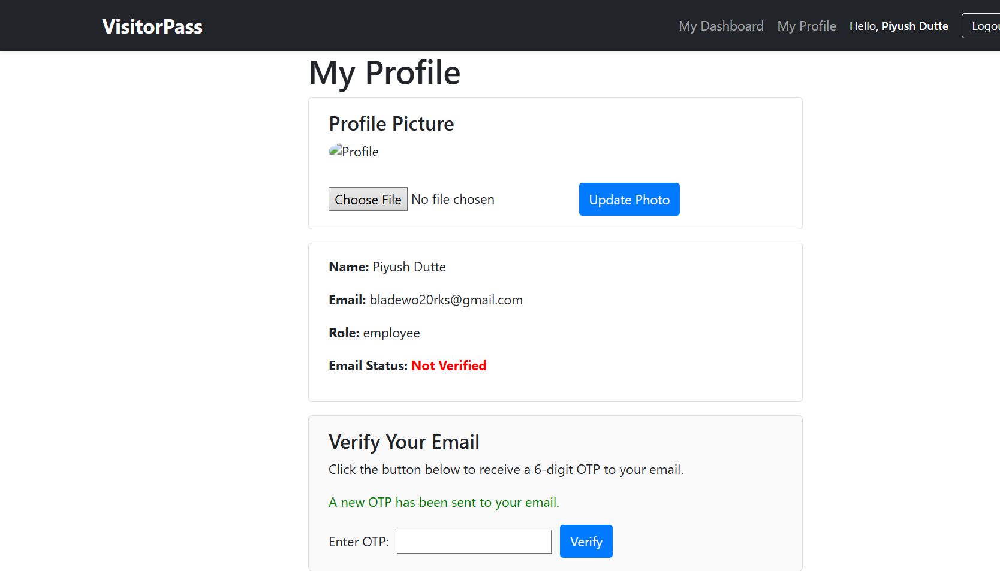
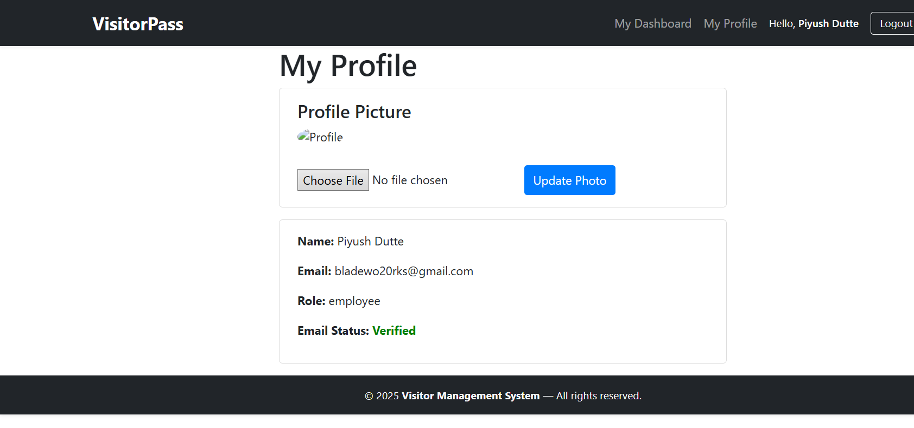

# Visitor Pass Management System (MERN)

A full-featured, MERN stack application for managing visitor passes digitally. This system replaces manual entry registers with a secure, role-based platform for pre-registration, walk-in registration (with OTP verification), QR code pass generation, and real-time check-in/check-out scanning.

---

## ✨ Core Features

* **Role-Based Access Control (JWT):** Four distinct user roles (Admin, Security, Employee, Visitor).
* **Visitor Dashboard:** Logged-in visitors can request appointments, track their status, and view/download their approved digital pass.
* **Security Dashboard:**
    * Secure multi-step walk-in registration with email OTP verification.
    * Live QR code scanner for visitor check-in and check-out (with same-day date validation).
* **Employee Dashboard:** Employees (Hosts) can log in to approve or reject their pending visitor appointments.
* **Admin Dashboard:**
    * Full user (staff) management (Create/Delete Security & Employee accounts).
    * Advanced reporting dashboard for all check-in/check-out logs with search, filtering, and **CSV export**.
    * Report of all walk-in visitors, including which security staff registered them.
* **Digital Pass Generation:** Automatically generates a downloadable, digital pass (as a PNG card) with the visitor's profile photo, details, and unique QR code.
* **Email & OTP System:**
    * **Email Verification:** Users verify their email on their profile page via OTP.
    * **Password Reset:** Secure "Forgot Password" flow using an email OTP.
* **Cloud Media Management:** Securely uploads all visitor photos and QR codes to **Cloudinary**.
* **Profile Management:** Logged-in users can update their profile picture and verify their email.

---

## 🚀 Tech Stack

* **Frontend:** React (with Vite), React Router, `html-to-image`, `react-csv`, `html5-qrcode`
* **Backend:** Node.js, Express.js
* **Database:** MongoDB (with Mongoose)
* **Authentication:** JSON Web Tokens (JWT), `bcryptjs`
* **File Storage:** Cloudinary (for photos and QR codes)
* **Email:** Nodemailer (with Gmail)
* **QR Codes:** `qrcode`

---

## 🏁 Getting Started

Follow these instructions to get a copy of the project up and running on your local machine for development and testing.

### Prerequisites

You will need the following accounts and software installed:

* **Node.js** (v18 or later): [https://nodejs.org/](https://nodejs.org/)
* **MongoDB Atlas Account** (free): [https://www.mongodb.com/cloud/atlas](https://www.mongodb.com/cloud/atlas)
* **Cloudinary Account** (free): [https://cloudinary.com/](https://cloudinary.com/)
* **Gmail Account** (for email sending):
    * You must enable 2-Step Verification.
    * You must generate a 16-character **"App Password"**. (Do not use your regular password).

### Installation

1.  **Clone the repository:**
    ```sh
    git clone <your-repository-url>
    cd visitor-management-system
    ```

2.  **Install Backend Dependencies:**
    * Navigate to the `backend` folder:
    ```sh
    cd backend
    ```
    * Run the installation command:
    ```sh
    npm install express mongoose jsonwebtoken bcryptjs dotenv cors express-async-handler multer cloudinary qrcode nodemailer
    ```

3.  **Install Frontend Dependencies:**
    * Navigate to the `frontend` folder:
    ```sh
    cd ../frontend
    ```
    * Run the installation command (assuming you started with Vite):
    ```sh
    npm install react-router-dom html5-qrcode react-csv html-to-image
    ```

### Environment Variables

The backend relies on a `.env` file for all secret keys.

1.  Go to the `backend` folder.
2.  Create a file named `.env`
3.  Copy and paste the following, filling in your own keys.

```.env
# MongoDB Atlas Connection String
MONGO_URI=mongodb+srv://<your_username>:<password>@yourcluster.mongodb.net/visitor-pass-db?retryWrites=true&w=majority

# JWT Secret
JWT_SECRET=yourverystrongsecretkey

# Cloudinary Credentials
CLOUDINARY_CLOUD_NAME=<your_cloud_name>
CLOUDINARY_API_KEY=<your_api_key>
CLOUDINARY_API_SECRET=<your_api_secret>

# Nodemailer (Gmail) Credentials
EMAIL_USER=<your_gmail_address@gmail.com>
EMAIL_PASS=<your_16_character_app_password>

# Frontend URL (for email links)
# If using Vite, this is typically http://localhost:5173
FRONTEND_URL=http://localhost:5173
```
---
## 📸 Screenshots

<div align="center">

### Home | Login | Register




### Admin | Security | Visitor




### Employee | Email Verification | Profile




</div>


---

## 🎥 Demo Video

[](main/videos/20251031195137.mp4)


